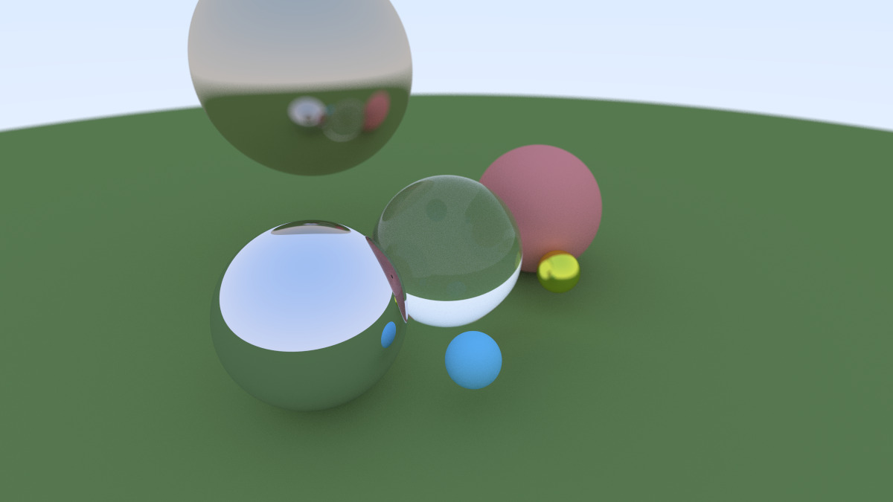

# Ray Tracing Image Generator

"Ray Tracing in One Weekend" 시리즈를 참조하여 구현한 레이 트레이싱 이미지 생성기입니다.

## 결과물 예시



## 프로젝트 구조

```
raytracing_one_weekend/
├── include/          # 헤더 파일
│   ├── vec3.h       # 3D 벡터/점 클래스
│   ├── color.h      # 색상 관련 유틸리티
│   └── ray.h        # 광선 클래스
├── src/             # 소스 파일
│   ├── main.cpp     # 메인 프로그램
│   ├── vec3.cpp     # vec3 구현
│   └── color.cpp    # 색상 처리 구현
├── images/          # 결과물 이미지
├── build/           # 빌드 결과물 (git 제외)
└── CMakeLists.txt   # CMake 빌드 설정
```

## 요구사항

- C++17 이상
- CMake 3.10 이상
- 컴파일러: GCC, Clang, 또는 MSVC

## 빌드 방법

### Windows
```bash
cmake -B build
cmake --build build --config Release
```

### Linux/macOS
```bash
mkdir build
cd build
cmake ..
make
```

## 실행 방법

```bash
# Windows
build\Release\raytracing_one_weekend.exe > image.ppm

# Linux/macOS
./build/raytracing_one_weekend > image.ppm
```

## 참고 자료

- [Ray Tracing in One Weekend](https://raytracing.github.io/)

## 라이선스

Educational purposes only
